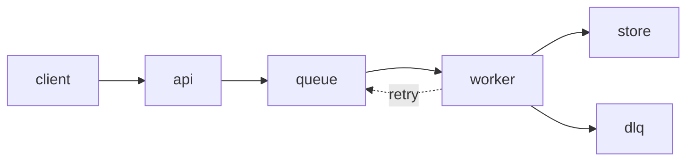

# Ingest rework — sign-off

The batch cap is 500 records. Retries use no backoff. Failures go to the dead
letter queue after three attempts.

## Flow

## Rollout

- Ship behind a flag, default off.
- Enable for one tenant, watch for a day.
- Enable for everyone.
